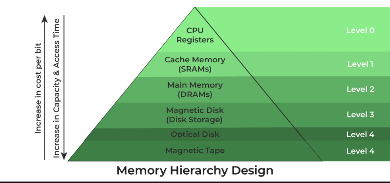
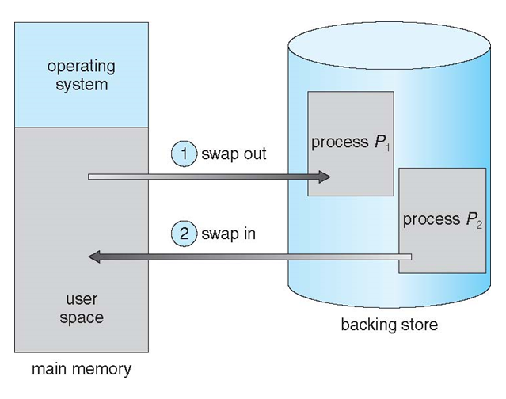

# Task Scheduling
## 1. Motivatie
- Programele trebuie aduse de pe ***disk*** in memorie si pornit un proces pentru a executa
- Vrem sa executam operatiile corect pentru a **proteja** memoria

## 2. Ierarhia memoriei
1. Registri
- se afla **in CPU**
- au cel mai rapid acces, **sub 1CC**
- sunt **mici**, doar cativa bytes

2. Cache
- se afla *aproape de CPU*
- unitati mici de memorie
- acces rapid
- se pun datele **accesate frecvent(temporal)** sau **in localitate(spatial)**, mai multe [aici](https://www.geeksforgeeks.org/locality-of-reference-and-cache-operation-in-cache-memory/)
    - explicat informal: Te apuci sa faci curat in casa. Iti iei o carpa si un spray de mobila din debara si incepi sa stergi praful, iti iei dupa tine si pamatuful (erau pe acelasi raft) pentru ca te astepti sa fie nevoie si de el si ar fi neplacut sa te duci iar dupa el, daca il folosesti ai un ***cache hit***. Daca se intampla sa fie asa dezastru in casa in cat sa ai nevoie si de trafalet sa varuiesti iar... ai un ***cache miss***, nu aveai obiectul la indemana

3. Memoria Principala
- mare
- lenta
- tine date si instructiuni de care are nevoie in prezent CPU-ul
- **volatila**, cand stingi PC-ul dispar (analog pentru celelalte nivele de mai sus)

4. Memoria Secundata
-  ***hard disk drives*** (HDD) si ***solid-state drives*** (SSD)
- **non-volatila**
- tine instructiuni de care **nu are nevoie CPU-ul** in prezent

5. Disk Magnetic
- plate-uri circulare dintr-un material magnetic
- bune la viteze mari
- deseori folosite in PC-uri

6. Benzi magnetice
- un device magnetic de inregistrat acoperit intr-un film de plastic
- foarte lent
- folosit pentru back-up

| **Level**       | **1**            | **2**            | **3**             | **4**               |
|-----------------|------------------|------------------|-------------------|---------------------|
| **Name**        | Register         | Cache            | Main Memory       | Secondary Memory    |
| **Size**        | <1 KB            | less than 16 MB  | <16GB            | >100 GB             |
| **Access Time** | 0.25ns to 0.5ns  | 0.5 to 25ns      | 80ns to 250ns     | 5,000,000 ns          |
| **Bandwidth**   | 20,000 to 100,000 MB | 5,000 to 15,000 MB | 1,000 to 5,000 MB  | 20 to 150 MB        |
| **Managed by**  | Compiler         | Hardware         | Operating System  | Operating System    |
| **Backing Mechanism** | From cache | From Main Memory | From Secondary Memory | From I/O        |

(*)banwidth = marimea canalului prin care se transmit datele



## 3. Base and Limit
- OS-ul este cel care aloca procesele, el decide cat spatiu poate ocupa fiecare, ***spatiul de adrese***
- Avem nevoie de un mod simplu de adresare, usor de modificat in cazul in care realocam procesul in alt spatiu
- De ce informatii ale unui proces avem nevoie pentru a stii de unde pana unde se afla?
    - ***Base***  -> de unde incepe
    - ***Limit*** -> cat de mare e


- Primim o adresa de memorie si vrem sa verificam daca se afla in bound-ul procesului nostru.
- Daca nu se afla in bound, 'atingem' alt proces sau o zona reziduala -> ***segmentation fault***
- un program malitios ar putea incerca sa iasa din bound-ul procesului, sau un program scris prost :)
- Orice proces ce incearca sa iasa din address space-ul lui vi fi **omorat** de OS.
- Check-ul este realizat la fiecare accesare de memorie si este **implementat hardware**


> [!NOTE]  
> De ce tinem in ***limit*** marimea procesului si nu adresa la care se termina?

## 4. Address Binding
- Daca nu gasim un mecanism de realocare, toate procesele ar astepta sa inceapa de la adresa 0x0000, adica putem rula un singur program la un moment de timp, deci pierdem tot paralelismul

- Care e primul proces de pe un PC si ce implicatii are cu punctul precedent?

- De asemenea, adresele arata diferit de-a lungul unui program:

| **Stage**        | **Address Type**        | **Example**                         |
|------------------|-------------------------|--------------------------------------|
| Source Code      | Symbolic addresses      | `int x`, `goto LABEL`               |
| Compiled Code    | Relocatable addresses   | “14 bytes from the start of module” |
| Execution        | Absolute addresses (physical) | `0x74014` (actual memory location)  |

### Reminder: Trecerea de la Program la Proces


## 5. Spatii de memorie Logice si Fizice
- Adrese logice: 
    - generate de CPU
    - referite ca ***adrese virtuale***
    - "fake"
- Adrese fizice:
    - ***adrese reale*** de din hardware
    - asa cum sunt vazute de Memory-Management Unit (MMU)

- Sunt aceleasi intre ***compile-time*** si ***load-time***
- Difera la ***execution-time***

- Logical address space -> toate adresele logice generate de un proces
- Physical address space -> toate adresele fizice generate de un proces

> [!NOTE]  
> Programul unui user vede numai **adrese logice**, nu stie la ce **adrese fizice** se afla

## 6. Memory-Management Unit (MMU)
- Componenta **hardware**
- Mapeaza la **run-time** adresele ***logice(virtuale)*** de cele ***fizice***
- Exista mai multe implementari
    - la fiecare adresa din user process adaugam valoarea din ***registrul de relocare*** (base-ul de mai devreme)


## 7. Dynamic Linking
***Linking Static*** 
- Codul din biblioteci esti combinat de loader cu cel din program in imaginea binarului

***Linking Dynamic*** 
- Linking-ul se face la run-time
- Daca o bucata de cod lipseste din address space-ul procesului, este cautata si adaugata
- Foarte util cand folosim librarii
- Se poate ca versiunea metodei din librarie sa fie ***deprecated*** si sa aflam tarziu, deci conteaza versiunile librariilor

## 8. Swapping
- Un proces poate fi **scos** din memoria principala si adus mai tarziu inapoi pentru a continua executia
- Se poate intampla cand memoria principala libera este foarte mica
- ***Backing store*** 
    - disk rapid suficient de mare pentru a tine mai multe copii de procese pentru toti userii
    - trebuie sa ofere acces direct catre imagini
- ***Roll out, roll in***
    - varianta de swapping pentru algorimtii de schedulebazati pe prioritati

- Mare parte din swap este ocupata de ***transferul datelor***, care e proportional cu dimensiunea memoriei care trebuie mutata (se face hardware deci timpul fizic de transfer al unui block e acelasi pentru toata lumea)

- Sistemul mai tine si o coada pentru procesele ready-to-run de pe disk

- Procesul trebuie realocat la aceeasi adresa fizica?

- OS-urile moderne folosesc variatii ale swap-ului clasic



## 9. Context Switch

- Daca procesul pe care il vrem nu se afla in memorie, trebuie adus din backing store -> ***context switch*** foarte lung

- **Nu putem** da swap switch **cand asteptam I/O** 
    - procesul nu va fi pus inapoi la aceeasi adresa, iar datele vor ajunge la adresa gresita
    - daca am incerca ***double buffering*** (sa transmitem in kernel space apoi la I/O device) adauga doar mai mult ***overhead***
- Pe **mobile**:
    - spatiul este mic
    - randamentul intre ***flash memory*** si **CPU** este foarte slab
    - **iOS** -> cere aplicatiilor sa dezaloce voluntar resurse
    - **Android** -> incheie direct procesul, dar ii salveaza state-ul in flash pentru a-l reporni mai repede

## 10. Alocare contingua
- O prima idee ar fi sa alocam procesele unul dupa altul
- Sistemul de operare la adrese mici
- Procesele user-ului la adrese mari
- Fiecare proces ocupa un block continuu

- Ce se intampla daca **P2** se termina inainte de **P3**?

> [!NOTE]
> **Continuu vs Contiguu**  
> - ***Contiguu***: Pentru lucruri fizice care se ating/sunt conectate
>   - exemplu: Tarile dintr-un continent sunt dispuse **contiguu**
> - ***Continuu***: Ceva care continua fara intrerupere
>   - exemplu: O linie fara intreruperi e **continua**

## 11. Alocare Multi-paritition
- ***Partitie*** -> Slot de memorie variabil ca marime
- ***Gaura*** -> block de memorie nealocata
- Cand un proces apare, ii cautam o gaura suficient de mare unde sa il alocam
- Nivelul de multiprogramare pe care il putem avea depinde de numarul maxim de partitii
- OS-ul trebuie sa tina minte informatii despre ***partitiile alocate*** si ***partitiile libere***


- Cum alegem gaura buna? ( ͡° ͜ʖ ͡°)
    - ***First-Fit*** -> prima gaura suficient de mare (ca in poza de mai sus)
    - ***Best-Fit*** -> cea mai mica gaura suficient de mare  
        -> lasa cele mai mici resturi posibile :)  
        -> trebuie cautata intreaga lista :(  
    - ***Worst-Fit*** -> cea mai mare gaura  
        -> trebuie cautata intreaga lista :(

## 12. Fragmentare
- ***Fragmentare Externa*** : Avem gauri intre partitii, adica nu avem alocare contigua
    - **Solutie** Compactam spatiile goale, luam mai multe block-uri cu gauri intre ele si le aducem unul langa altul.
        - Nu putem face **I/O** cat le mutam, trebuie buffer-uit uneva
        - Functioneaza doar pentru **relocari dinamice** si se face la **run-time**

- ***Fragmentare Interna*** : Partitiile pe care le alocam sunt putin mai mari decat spatiul alocat procesului

## 13. Segmentare
- Schema de management al memoriei
- Ca user ai un view mai bun al memoriei
- Considera ca un program este ***o colectie de segmente***
- Un segment este ***o unitate logica*** precum: functii, metode, programu main, obiecte, tabelu de simboluri, etc


## 14. Arhitectura Segmentarii
- O **adresa logica** e formata dintr-un tuplu ***<segment-number, offset>*** 
- ***Segment-table*** 
    - mapeaza **adrese fizice** 2D
    - o intrare contine ca date **base, limit**
    - o intrare mai are si **1bit de validare** (0 -> illegal segment) si **privilegiile** read/write/execute (Cati biti sunt necesari sa reprezentam informatia asta?)
- ***Segment-table base register (STBR)*** : Pointer catre tabelul de segmente al unui program
- ***Segment-table length register (STLR)*** : Numarul de segmente al unui program


In diagrama de mai sus:
1. ***CPU*** genereaza o ***adresa logica(Segment_number, Displacement/offset) -> s|d***
2. Cauta in ***segment table*** intrarea corespunzatoare lui ***s***
3. Verifica daca ***offset-ul d*** depaseste ***limita***
4. Daca nu depaseste, ii adaugam ***base-ul*** si am aflat ***adresa fizica***. Altfel ***eroare***

## 15. Paginare
**Spatiul de adresele fizice** ale unui proces poate sa nu fie contiguu
Am vrea sa evitam: 
- ***fragmentarea externa*** 
- ***chunk-urile de memorie*** de marime ***variabila***

 
> [!TIP]  
> Impartim ***adresele fizice*** in blocuri de dimensiuni fixe numite ***frame-uri***
> De obicei puteri ale lui 2 (4KiB), dar poate fi modificat.

> [!TIP]  
> Impartim ***adresele logice*** in blocuri de **acelasi size cu cele fizice**  numite ***page-uri***

- Vom avea nevoie de un ***page table*** unde sa traducem adresele logice in adrese fizice
- Vom imparti si **back store-ul** la fel

> [!WARNING]  
> Inca va exista ***fragmentare interna***

```c
/* Snip de cod pentru a vedea PAGE_ZISE-ul pe UNIX/POSIX */

#include <stdio.h>
#include <unistd.h> /* sysconf(3) */

int main(void)
{
	printf("The page size for this system is %ld bytes.\n",
		sysconf(_SC_PAGESIZE)); /* _SC_PAGE_SIZE is OK too. */

	return 0;
}
```

```c
/* Snip de cod pentru a vedea PAGE_ZISE-ul pe Windows */

#include <stdio.h>
#include <windows.h>

int main(void)
{
	SYSTEM_INFO si;
	GetSystemInfo(&si);

	printf("The page size for this system is %u bytes.\n", si.dwPageSize);

	return 0;
}
```

## 16. Cum traducem Page-urile in adrese?
Adresele generate de CPU se impart in:
- ***page number (p)***
    - e ca un **index** intr-un **page table** care contine inceputul fiecarui **page** in **memoria fizica**
- ***page offset (d)***
    - ***d*** de la ***displacement***
    - adunat la ***p*** pentru a aflat **adresa fizica** trimisa la ***MMU***


- Pentru imaginea de sus:
    - cate adrese avem?
    - cate page-uri avem?
    - cate adrese avem pe un page?

Exemplu generic:  


Exemplu unde: **n=2, m=4 32-byte memory, 4-byte pages**
- n=2 -> avem maxim 2^2 page-uri
- m=4 -> avem maxim 4 adrese pe 1page 
- memoria e de 32bytes deci am avea loc de 8 page-uri, dar nu ne permite tabela sa avem mai mult de 4 


Imagine de ansamblu: 

1. Observam ca:
- **adresele logice** sunt pe **13bits**, ***3p si 10d***
- **adresele fizice** sunt pe **12bits**, ***2f si 10d***
- ambele au ***PAGE_SIZE=10***

2. CPU 'scuipa' **adresa logica** 111.0000001010 -> 3.10
- avem **offest-ul d=10**
- cautam in **page table** pagina **p=3** si gasim corespondenta cu frame-ul **f=2**

3. Avem totul pentru a determina **adresa fizica**:
- adunam la **f** pe **d**
- done.

## 17. Cum determinam de cate Page-uri avem nevoie?
Exemplu:
- **PAGE_SIZE**=2,048 bytes
- **PROCESS_SIZE**=72,766 bytes
- **PRCOESS_SIZE** / **PAGE_SIZE** => 35 page-uri + 1,086 bytes => 36 page-uri
- formula ar fi ***ceil(PRCOESS_SIZE / PAGE_SIZE)***
- Cat e fragmentarea interna?
    - pai in urma impartirii ne-au ramas 1,086 bytes
    - 1page = 2,048 byes
    - 2048 - 1086 = 962 bytes **nefolositi**
    - Worst case? Best case?

## 18.Cum alegem page-urile?
- Vedem cate page-uri ocupa procesul
- Alegem primele page-uri libere din tabela de ***free pages***  
- Completam tabela


## 19. Implementarea Page Tabel-ului

## Referinte:
- https://www.geeksforgeeks.org/paging-in-operating-system/