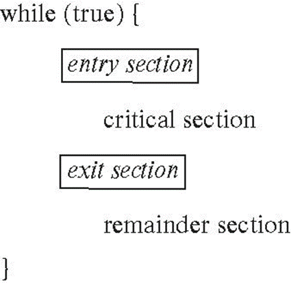
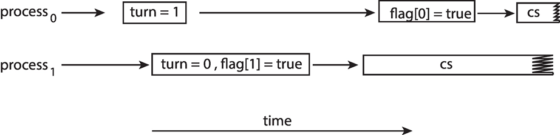

# Process Synchronization

## Recapitulare Procese

Procesele sunt programe in executie. Procesele pot fi executate in mod concurent.
Putem avea 2 procese care sa partajeze aceeasi zona de memorie. 
**De ce vrem asta?** => Pentru a paraleliza work load-ul (eficientizare)

But guess what? A face asta inseamna a da de alte probleme:
1. Race Condition (am vorbit la ora de procese)
2. Data Consistency

## Critical-Section Problem

### Descrierea problemei

Fie un sistem de n procese (p0, p1, ..., pn), fiecare avand o zona critica de memorie astfel incat:
- Cand un proces este in zona sa critica, niciun alt proces nu este in zona lui critica

Zona critica poate fi:
- schimbarea unei variabile
- actualizarea unei structuri de date
- scrierea intr-un fisier etc

Problema sectiunii critice este de a crea un protocol care sa rezolve asta.

**Important de mentionat:** Fiecare proces trebuie sa ceara permisiune pentru a intra in zona sa critica (**entry section**), apoi poate urma zona sa critica cu **exit section**, si restul codului (**remainder section**)

Structura generala:



#### Cerinte pentru rezolvarea Critical-Section problem

1. **Mutual exclusion** - daca procesul Pi este in zona sa critica, atunci niciun alt proces nu poate fi in zona lui critica
2. **Progress** - daca niciun proces nu este in zona sa critica si exista procese care vor sa intre in zona lor critica, atunci selectia procesului care va intra primul in zona critica nu poate fi amanata la nesfarsit (trebuie la un moment dat sa intre in zona critica)
3. **Bounded Waiting** - trebuie sa existe o limita pe numarul de intrari in zona critica a altor procese daca un proces (de exemplu Pi) a cerut sa intre in zona lui critica si pana cand acest proces (procesul Pi) chiar intra in zona lui critica

## Solutii

### Software Solution 1

- Solutie cu 2 procese
- Presupunem ca **load** si **store** sunt instructiuni atomice (e.g nu pot fi intrerupte)
- Cele 2 procese partajeaza variabila
```int turn;```
- Variabila ```turn``` indica cine poate intra in zona critica
- Initial ```turn = i;```

#### Algoritm
```
while (true) {
    while (turn == j);
    /* critical section */
    turn = j;
    /* remainder section */
}
```

#### Corectitudinea solutiei

- **Mutual exclusion** => in mod evident, aceasta este indeplinita, deoarece pentru ca Pi sa intre in zona sa critica, ```turn``` trebuie sa fie **i**, iar ca Pj sa intre in zona sa critica, ```turn = j``` este conditia. ```turn``` nu poate fi si **i** si **j** in acelasi timp
- **Progress** => la prima vedere am putea crede ca progresul este indeplinit, insa se poate intampla un **race condition** si fiecare proces sa aiba o varianta alternata a variabilei ```turn``` si astfel ambele sa astepte
- **Bounded-Waiting**
- **Busy Waiting** (Inefficient) => Această abordare utilizează busy waiting, în care fiecare proces verifică în mod continuu dacă poate intra în secțiunea critică prin reluarea în buclă a condiției while (turn == j);. Aceasta este ineficientă deoarece ciclurile CPU sunt irosite pentru verificarea condiției în loc să permită procesului să doarmă sau să efectueze alte sarcini.

### Solutia lui Peterson

- Avem 2 procese ca mai devreme
- ```load``` si ```store``` instructiuni atomice
- Cele 2 procese partajeaza 2 variabile acum:
```
int turn;
boolean flag[2];
```
- variabila ```turn``` indica al cui e randul sa intre in zona critica
- vectorul ```flag``` indica daca un proces este gata sa intre in zona sa critica
```flag[i] = true``` implica ca procesul Pi este gata

#### Algoritm
```
while (true) {
    flag[i] = true;
    turn = j;
    while (flag[j] && turn == j);
    /* critical section */
    flag[i] = false;
    /* remainder section */
}
```

#### Corectitudine

- **Mutual exclusion** => este indeplinita
- **Progress** => este satisfacuta
- **Bounded-Waiting** => ✅

#### Solutia lui Peterson pe arhitecturi moderne

- Desi este utila pentru demonstrarea unui algoritm, solutia lui Peterson nu este garantata sa mearga pe arhitecturi moderne (deoarece pentru a imbunatati performanta, procesoarele si compilatoarele vor reordona operatiile ce nu au dependinte)
- Pentru single-threaded este ok, caci rezultatul va fi mereu acelasi
- Pentu multi-threaded, reordonarea poate produce inconsecvente

Exemplu:

- 2 thread-uri partajeaza:
```
boolean flag = false;
int x = 0;
```
- Thread 1 face:
```
while (!flag)
    ;
print x
```
- Thread 2 face:
```
x = 100;
flag = true;
```
- Ce ne asteptam sa afiseze? 
Raspuns: **100**

- Totusi fiindca variabilele ```flag``` si ```x``` sunt independente, instructiunile pot fi reordonate astfel:
```
flag = true;
x = 100;
```
Ceea ce va rezulta in afisarea lui **0**

#### Cum putem rezolva problema aceasta pentru arhitecturi moderne?


- Pentru ca asta sa nu se intample, trebuie sa utilizam **Memory Barrier**

## Memory Barrier

- aceasta este o instructiune ce forteaza ca orice schimbare in memorie sa fie propagata (sa fie facuta vizibila) tuturor celorlalte procese
- cand o instructiune de tipul **memory barrier** este utilizata, sistemul se asigura ca toate actiunile ```loads``` si ```stores``` sunt completate, pana cand alt ```load``` ori ```store``` va mai fi executat

#### Cum se poate aplica pentru a rezolva problema pentru arhitecturile moderne

Thread 1 executa:
```
while (!flag)
    memory_barrier();
print x
```

Thread 2 executa:
```
x = 100;
memory_barrier();
flag = true;
```

Ce a schimbat acel ```memory_barrier()```?
- Pentru Thread 1 a garantat ca valoarea lui ```flag``` este incarcata inaintea variabilei ```x```
- Pentru Thread 2 a asigurat ca ```x = 100``` se intampla inaintea schimbarii lui ```flag = true```

## Synchronization Hardware

- Mai toate sistemele ofera suport hardware pentru a implementa codul sectiunii critice
- Printre cele mai importante variante se numara:
1. Hardware Instructions
2. Variabile atomice

### Hardware Instructions
- Instructiuni speciale hardware care ne lasa fie sa testam-si-modificam continutul unui cuvant sau sa schimbam in mod atomic continutul a 2 cuvinte (e.g in mod neintrerupt)
1. **Test-and-Set** instruction
2. **Compare-and-Swap** instruction

#### Test-and-set

**Definitie**
```
boolean test_and_set (boolean *target)
{
    boolean rv = *target;
    *target = true;
    return rv;
}
```

**Proprietati**
- Executat atomic
- Returneaza valoarea originala a parametrului
- Seteaza valorea parametrului dat functiei in ```true```

#### Solution using test_and_set()
- Avem variabila ```lock``` partajata, initializata cu **false**
- Solutia:
```
do {
    while (test_and_set(&lock))
        ;
    /* critical section */

    lock = false;
    /* remainder section */
} while (true);
```
- Intrebarea este: Rezolva oare problema sectiunii critice?

#### Compare-and-swap
**Definitie**
```
int compare_and_swap(int *value, int expected, int new_value) {
    int temp = *value;
    if (*value == expected)
        *value = new_value;
    return temp;
}

**Proprietati**
- Executat atomic
- Returneaza valoarea originala a parametrului ```value```
- Seteaza variabila ```value``` la **new_value**, dar doar daca ```*value == expected```. Asta inseamna ca schimbarea valorii se intampla doar in conditiile acestea
```

### Mutex Locks

### Semaphores

### Monitors