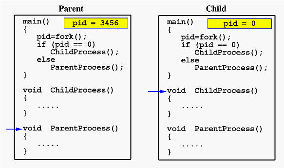

# Procese

## Procese

### Definitie

Un program in executie. Executia procesului trebuie sa mearga in maniera secventiala. Nu se pot executa instructiuni in paralel pentru un singur proces.
Programul devine proces cand acesta este incarcat in memorie.

### Process Data


Într-un proces, memoria este împărțită în mai multe secțiuni principale:

- **Text:** Conține codul programului (instrucțiuni în formă de cod mașină).
- **Data:** Conține variabile globale și statice. Acestea pot fi fie inițializate, fie neinițializate.
- **Heap:** Reprezintă spațiul de memorie utilizat pentru alocări dinamice de date în timpul execuției programului (ex: prin `malloc()` în C).
- **Stack:** Utilizat pentru a păstra variabile locale sau date temporare cum ar fi apelurile de funcții, adresele de retur și variabilele locale. Stack-ul crește și scade în funcție de profunzimea apelurilor funcțiilor din cadrul unui proces.


In text section se tine *Program Code-ul*, practic machine code-ul programului

### Process Control Block (PCB)


PCB-ul este o structură de date menținută de sistemul de operare pentru a gestiona fiecare proces în parte. Fiecare proces are propriul PCB, care conține informații esențiale despre starea și execuția sa:

- **Starea procesului:** Indică dacă procesul este în starea `Running`, `Waiting`, `Ready`, etc.
- **PID (Process Identifier):** ID-ul unic al fiecărui proces.
- **Contorul de program:** Ține evidența ultimei instrucțiuni executate.
- **Registrii de stare:** Include valorile curente ale registrilor CPU
- **Informații despre memorie:** Include tabele de paginare, limite de segmentare și adrese de bază.
- **Lista de fișiere deschise:** Reține descriptorii de fișiere ale procesului.


### Process States


Un proces poate exista în una din mai multe stări diferite, în funcție de acțiunile sale și de deciziile planificatorului de procese (scheduler):

1. **New:** Procesul este creat, dar nu încă în execuție.
2. **Ready:** Procesul este pregătit să fie executat, dar CPU-ul nu este încă alocat.
3. **Running:** Procesul are alocat CPU și execută efectiv instrucțiuni.
4. **Waiting (Blocked):** Procesul așteaptă un eveniment (de exemplu, I/O).
5. **Terminated:** Execuția procesului s-a încheiat.

### Fork-uri


Funcția `fork()` din Unix și Linux este folosită pentru a crea procese copil. Un apel la `fork()` va face următoarele:

- Creează un proces nou (proces copil) care este o copie exactă a procesului părinte.
- Procesul copil primește propriul PID și propria copie a spațiului de memorie al procesului părinte, cu toate resursele duplicate (fișiere deschise, variabile, etc.).
- După apelul `fork()`, două procese continuă execuția în paralel: părinte și copil, fiecare executând următoarele instrucțiuni după `fork()`, dar având rezultate diferite pentru apelul `fork()` (0 în copil și PID-ul copilului în părinte).

#### Process Termination
Când un proces își finalizează execuția, acesta cheamă sistemul de operare pentru a fi terminat prin apelul `exit()`. Resursele sale sunt eliberate, iar starea finală este transmisă procesului părinte folosind `wait()`.

- Dacă părintele așteaptă, procesul copil returnează starea sa finală.
- Dacă părintele nu așteaptă, procesul devine un **zombie**.
- Dacă procesul părinte se termină înainte ca procesul copil să se termine, copilul devine **orfan** și este adoptat de sistemul de operare.

**Cascading termination** - Unele sisteme de operare nu permit copiiilor (child from fork) sa existe daca parintele lor a terminat executia. Daca un proces si-a terminat executia, toti copiii sai vor termina fortat. 



```c
#include <unistd.h>
#include <sys/wait.h>
#include <stdio.h>
#include <sys/types.h>
#include <errno.h>

int main() {
    pid_t pid = fork();
    if (pid < 0) {
        return errno;
    } else if (pid == 0) {
        pid_t childPID = getpid();
        pid_t parentPID = getppid();
        printf("%s%i","Child PID = ",childPID);
        printf("\n");
        printf("%s%i","Parent PID = ",parentPID);
        printf("\n");

        char *argv[] = {"ls", NULL};
        execve("/usr/bin/ls",argv,NULL);
        perror(NULL);
    } else {
        wait(NULL);
    }
    return 0;
}
```

Exemplu de program in care copilul executa comanda `ls`


#### Exercitii examen

1. Scrieti codul pentru urmatoarea arborescenta de procese:

Pe foaia de examen trebuie sa scrieti ceva de genul (nu neaparat in modul asta):
```c
if(fork()) {
    // am intrat in procesul parinte (P1 si am creat mai sus P2)
    if(!fork()) {
        // am intrat in procesul copil (P3)
        if(!fork()) {
            // am intrat in procesul copil (P4)
            if(fork()) {
                // am intrat in procesul parinte (P4 si am creat pe P5)
                if (fork()) {
                    // am intrat in procesul parinte (P4 si am creat pe P6)
                    if (fork()) {
                        // am intrat in procesul parinte (P4 si am creat pe P7)
                    }
                }
            }
        }
    }
}
```

2. Desenati arborescenta pentru urmatorul cod:
```c
for (int i = 0; i < 3; ++i) {
    for (int j = i; j >= 0; --j) {
        fork();
    }
}
```

### Process Scheduling

Un proces poate trece între stările `Ready`, `Running`, și `Waiting`, în funcție de deciziile planificatorului (scheduler) din sistemul de operare. Scheduler-ul decide care proces să primească CPU-ul pentru a rula.

### Context Switch

Un **context switch** apare atunci când sistemul de operare schimbă execuția de la un proces la altul. În timpul unui context switch, starea procesului curent este salvată, iar starea următorului proces este restaurată, astfel încât acesta să continue execuția de unde a fost întrerupt.

### Interprocess Communication (IPC)

Procesele trebuie să comunice între ele pentru a coordona activități sau pentru a partaja date. Mecanismele de comunicare între procese includ:

- **Shared Memory:** Două sau mai multe procese partajează o zonă de memorie comună.
- **Message Passing:** Procesele trimit și primesc mesaje între ele printr-un canal de comunicare (ex: prin **pipe**).


#### Producer-Consumer Problem

- Paradigma pentru procese care coopereaza
- Procesul **producer** produce informatie care este consumata de procesul **consumer**
- Sunt 2 variatii ale problemei:
1. **Unbounded-buffer** - nu exista limita pe marimea buffer-ului => *producer* nu asteapta niciodata
2. **Bounded-buffer** - exista o limita pe marimea buffer-ului => *producer* asteapta daca toate buffer-urile sunt pline

Va puteti gandi la aceasta problema din perspectiva unui supermarket. Producer-ul este angajatul, consumer-ul este clientul. Daca rafturile (buffer-urile) sunt pline, angajatul nu are ce produse noi sa puna si trebuie sa astepte clientul sa ia ceva de pe raft ca sa poata pune din nou produs.

Pentru **unbounded-buffer** rafturile sunt infinite, deci *angajatul* mereu va avea cate un raft pe care sa puna produsul.

#### Shared Memory

- O locatie din memorie partajata intre procesele care vor sa comunice
- Comunicarea este sub controlul **user-ului** nu al sistemului de operare
- Cea mai mare dificultate o reprezinta realizarea unui mecanism care sa permita sincronizarea proceselor sa intre la memoria partajata


##### Race condition

- De la ASC ati invatat ca `counter++` se traduce ca
```
register1 = counter
register1 = register1 + 1
counter = register1
```
Iar `counter--` este:
```
register1 = counter
register1 = register1 - 1
counter = register1
```

- Dar ce se intampla daca procesele care au acces la memoria partajata intra in mod simultan peste aceeasi variabila?
R: Se va produce un **race condition** adica se vor intrece intre ele si valoarea variabilei nu va mai fi cea corecta
---
**count = 5** initial:
**S0**: producer execute register1 = counter         {register1 = 5}
**S1**: producer execute register1 = register1 + 1   {register1 = 6} 
**S2**: consumer execute register2 = counter        {register2 = 5} 
**S3**: consumer execute register2 = register2 – 1  {register2 = 4} 
**S4**: producer execute counter = register1         {counter = 6 } 
**S5**: consumer execute counter = register2        {counter = 4}

#### Message Passing

- Procesele pot vorbi intre ele fara a se baza pe o variabila partajata
- Au acces la 2 operatii:
    - Send(message)
    - Receive(message)
---
- Procesele **P** si **Q** vor sa comunice, astfel ele trebuie sa:
   - Creeze un link de comunicare intre ele
   - Schimbe mesaje prin **send**/**receive**

- Ce eventuale probleme ar putea aparea?
    - Cum se creeaza link-ul?
    - Poate un link sa fie asociat cu mai mult de 2 procese?

##### Implementation of Communication Link
- Physical
    - Shared Memory
    - Hardware bus
    - Network
- Logical
    - Direct or indirect
    - Synchronous
    - Automatic or explicit buffering

**Direct Communication** - link-urile sunt create automat si este asociat cu exact 2 procese

**Indirect Communication** - Mesajele sunt trimise si primite prin *mailboxes* (denumite si port-uri)
- Astfel procesele pot comunica doar daca au partajat un mailbox
- Un link poate fi asociat cu mai multe procese
- Operatii: 
    - Creare un nou mailbox (port)
    - Send/receive mesaje prin port
    - Sterge mailbox

##### Sincronizare
**Message Passing** poate fi de 2 tipuri:
- **Blocking**
    - Blocking send - procesul care a trimis este blocat din a mai trimite pana cand mesajul a fost primit de un proces
    - Blocking receive - procesul care primeste este blocat din a apela functia de receiva pana cand un mesaj e valabil
- **Non-Blocking**
    - Non-blocking send - procesul trimite mesajul si isi continua executia normal
    - Non-blocking receive - procesul care asculta primeste ori mesajul, ori NULL

- Daca si send si receive sunt blocking se numeste **rendezvous**

### Pipes

- Actioneaza precum o teava care le permite proceselor sa comunice
- Probleme:
    - este comunicarea unidirectionala sau bidirectionala?

- **Ordinary pipes** - nu pot fi accesate din afara procesului care le-a creat. De obicei, sunt folosite de catre parinte pentru a comunica cu procesul copil
- **Named pipes** - pot fi accesate fara a fi nevoie de o relatie de tip parinte-copil

#### Ordinary Pipes

- Acestea permit comunicarea intr-o maniera producer-consumer
- Producatorul scrie la un capat (**write-end** of the pipe)
- Consumatorul citeste de la celalalt capat (**read-end** of the pipe)
- Este necesara relatia parinte-copil

#### Named pipes

- Comunicarea este bidirectionala
- Sunt mai puternice decat ordinary pipes (prin faptul ca nu necesita relatia parinte-copil si ca poate fi folosita de mai multe procese)

## Communication in Client-Server Systems
Sunt 2 tipuri:
- **Sockets**
- **Remote Procedure Calls(RPC)**

### Sockets

- Acesta este definit ca un **endpoint** pentru comunicare
- Concatenare de adresa IP si **PORT** (un numar inclus la startul mesajului pentru a diferentia intre diferitele servicii pe un host) 

### Remote Procedure Calls (RPC)

- **Remote Procedure Calls (RPC)** reprezintă un mecanism prin care un program poate apela o funcție care se execută pe un alt calculator din rețea, ca și cum ar fi apelată o funcție locală. RPC simplifică interacțiunea între aplicațiile distribuite, mascând complexitatea rețelei și detaliile comunicării.

#### Cum funcționează RPC?

1. **Clientul face apelul unei funcții (proceduri) la distanță**: Programul client apelează o funcție specificată, dar în loc să fie executată pe mașina locală, această funcție este apelată pe server.
   
2. **Stub-urile client și server**:
   - **Stub client**: Acest cod local (pe client) transformă apelul funcției într-un pachet de date (marshal) și îl trimite către server prin rețea.
   - **Stub server**: Pe server, acest cod primește pachetul, îl decodează (unmarshal) și apelează funcția dorită pe server. După execuția funcției, rezultatele sunt trimise înapoi clientului, prin aceleași mecanisme de marshal/unmarshal.

3. **Comunicarea între client și server**: În timpul procesului de RPC, clientul și serverul comunică printr-un protocol de transport, cum ar fi TCP/IP, care trimite și primește datele pe rețea.

4. **Răspunsul de la server**: După ce funcția este executată pe server, rezultatul este trimis înapoi la clientul care a efectuat apelul inițial, unde stub-ul client decodează răspunsul și returnează rezultatul programului client.

#### Beneficii ale RPC:
- **Transparența rețelei**: Programatorii pot folosi RPC fără a trebui să se preocupe de detaliile rețelei (ex. pachete de date, protocoale).
- **Ușurința de utilizare**: Permite dezvoltarea mai rapidă a aplicațiilor distribuite prin oferirea unui mod simplu de apelare a funcțiilor pe servere aflate la distanță.

#### Limitări:
- **Latență**: Deoarece comunicarea se face prin rețea, RPC introduce o întârziere (latență) mai mare decât apelurile de funcții locale.
- **Fiabilitate**: Eșecurile de rețea sau indisponibilitatea serverului pot afecta apelurile RPC, necesitând mecanisme de retry sau de tratare a erorilor.
- **Compatibilitate**: Atât clientul, cât și serverul trebuie să fie de acord asupra unui **protocol** de comunicare și să aibă aceleași definiții ale funcțiilor și datelor.

#### Exemple de implementări RPC:
- **gRPC**: Un sistem RPC modern dezvoltat de Google, care utilizează protocolul HTTP/2 pentru comunicare și **Protocol Buffers** pentru serializarea datelor.
- **XML-RPC** și **JSON-RPC**: Protocoale mai vechi, bazate pe formate textuale precum XML sau JSON pentru comunicare și serializare.

#### Diferențe între RPC și apelurile locale:
- **Latență**: Apelurile RPC implică trimiterea și primirea de mesaje pe rețea, ceea ce le face mai lente decât apelurile locale.
- **Fiabilitate**: Apelurile locale sunt de obicei mult mai sigure, în timp ce RPC poate eșua din cauza erorilor de rețea sau a indisponibilității serverului.

Remote Procedure Calls sunt utilizate pe scară largă în sistemele distribuite, oferind un mod intuitiv pentru ca aplicațiile să comunice între ele, indiferent de locația lor.


### Intrebari pentru examen

1. Ce este un proces?
2. Care sunt stările unui proces?
3. Explicati in ce conditii se face tranzitia de la o stare la alta? (puteti desena diagrama)
4. Numiți câteva câmpuri din cadrul **PCB** (adică ce informații sunt reținute despre procese).
5. Ce se întâmplă atunci când un proces face un **fork**?
6. Care e diferența dintre **heap** și **stack** în cadrul unui proces?
7. Ce se întâmplă cu un proces atunci când moare sau este terminat forțat?
8. Cum comunică procesele între ele? Dați un exemplu de mecanism.
9. Ce este un **zombie process** și de ce trebuie să ne preocupe existența lui?
