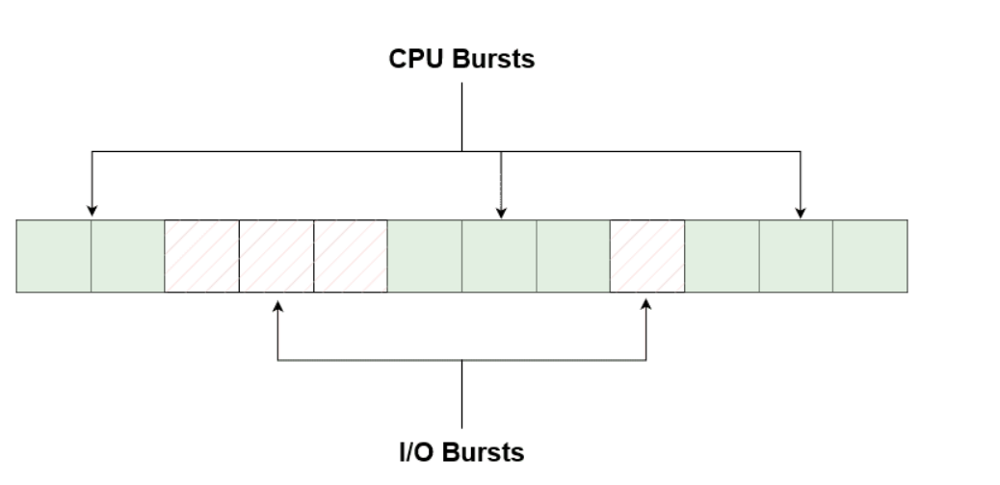
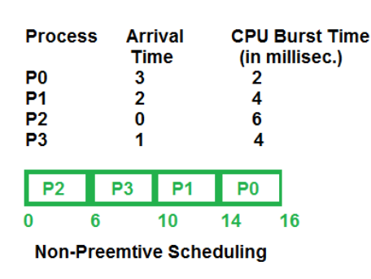
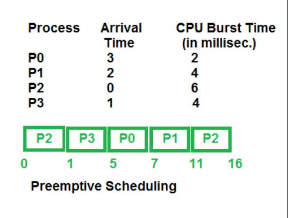

# Task Scheduling
## 1. Motivatie
- <b>Max CPU utilization:</b> Sa folosim la maxim CPU
- <b>Max throughput:</b> Sa complemtam cat mai multe task-uri intr-un interval de timp
- <b>Min turnaround time:</b> Sa minimizam timpul in care un task e dat jos de pe CPU
- <b>Min waiting time:</b> Sa minimizam timpul in care un task asteapta in ready queue
- <b>Min response time:</b> Sa minimizam timpul de cand a fost trimis un task pana cand a inceput sa ruleze pentru prima data

Le putem avea pe toate?

## 2. CPU/IO Bursts
- CPU Burst
    - Perioada in care un proces foloseste <b>activ</b> CPU pentru computatii.
    - Caracterizate de <b><i>durata</b></i> si <b><i>intensitate</b></i> (prin intensitate ne referim la cat de resource-demanding este, aceasta poate varia foarte mult in timpul unui proces)
- I/O Burst
    - Perioada in care un proces asteapta ca datele sa fie <b><i>citite</b></i> sau <b><i>scrise</b></i> din memorie, retea, etc.
    - Caracterizate de <b><i>waiting time</b></i> (cat dureaza sa fie executata operatia, depinde de viteza hardware-ului, mediul prin care trec datele, tipul operatiei) si <b><i>type</b></i>

> [~NOTE]
> I/O nu se refera neaparat la citit/scris de la tastatura, se refera de exemplu la citirea din memorie intr-un registru(fetch)
> [Fetch-Decode-Execute Cycle](https://www.geeksforgeeks.org/different-instruction-cycles/).

In cele mai multe cazuri burst-urile sunt <b>interconectate</b>. De exemplu o aplicatie web poate procesa request-uri (cpu burst) si citi/scrie date in memorie (i/o burst).  

## 3. CPU Scheduler
In principiu, alege un proces din <b><i>ready queue</b></i> si ii ofera locul pe CPU dupa o anumita <b>strategie</b>.

### 3.1 Non-preemptive
Deciziile Scheduler-ului pot aparea cand un proces isi schimba starea:
- running -> waiting
- running -> ready
- waiting -> ready
- devine terminated  

  

<b>Mai simplu</b>: Odata ajuns pe procesor, procesul nu va fi scos pana la o situatie de mai sus.

Cativa algoritmi:
- First Come, First Served (FCFS)
- Shortest Job First (SJF)
- Priority (non-preemptive version)

### 3.2 Preemptive
Procesele au un <b>timp limitat</b> pe care il pot petrece continuu pe CPU. Politica prin care alegem ce proces rulam depinde de algoritmul de Scheduling folosit.

<b>Concepte de considerat:</b>
- accesul la resurse comune
- procesele din kernel mode
- intreruperile din activitile cruciale ale OS-ului

Cativa algoritmi:
- Round Robin (RR)
- Shortest Remaining Time First (SRTF)
- Priority (preemptive version)

### 3.3 Tipuri de Scheduler
- Short-term 
    - Alege un proces din <b><i>ready queue</b></i>
- Medium-term 
    - Se ocupa de procesele ce necesita <b><i>I/O bursts</b></i>
- Long-term
    -  Decide <b>cate procese</b> pot ramane in ready queue
    -  Motivatia necesitatii este spatiul limitat din memoria principala, <b>programele</b> sunt initial tinute in <b><i>memoria secundata</b></i>, iar cand ajung in <b><i>memoria principala</b></i> ele devin <b>procese</b>
    - Practic, Long-term Scheduler-ul decide cat <b><i>multiprocessing</b></i> avem

## 4. Dispatcher
Treaba lui incepe dupa Scheduler. Dupa ce un task este ales, dispatcher-ul:
- muta procesul in <b>coada</b> corespunzatoare
- se ocupa de <b><i>context switch</b></i>
- schimba la <b><i>user mode</b></i>
- da <b><i>jump</b></i> la adresa de memorie corecta pentru a relua executia procesului 
- <b>trade off-ul</b> este ca si acesta necesita un <b>timp de executie</b>, chiar daca este destul de scurt si este dependent de <b><i>Scheduler</b></i>

## 5. Algoritmi
### 5.1 First Come, First Served (FCFS) - Non-preemptive
Procele sunt puse pe CPU in ordinea in care au venit cand este liber

| Process      | Burst Time    | Arrival |
| ------------ | ------------- | ------- |
| P1 | 24 | 0 |
| P2 | 3 | 1 |
| P3 | 3 | 2 |

    

        P1
        0
    

    

        P2
        24
    

    

        P3
        27
        30
    

| Process      | Wainting Time |
| ------------ | ------------- |
| P1 | 0 |
| P2 | Burst Time(P1) = 24 |
| P3 | Burst Time(P1) + Burst Time(P2) = 24 + 3 = 27 |

Averate Waiting Time = avg(0 + 24 + 27) = 17

> [!CAUTION]
> Timpul mediu de asteptare este dependent de ordinea in care vin procesele
> Spre exemplu:  

| Process      | Burst Time    | Arrival |
| ------------ | ------------- | ------- |
| P1 | 24 | 2 |
| P2 | 3 | 0 |
| P3 | 3 | 1 |

    

        P2
        0
    

    

        P3
        3
    

    

        P1
        6
        30
    

| Process      | Wainting Time |
| ------------ | ------------- |
| P1 | Burst Time(P2) + Burst Time(P3) = 3 + 3 = 6 |
| P2 | 0 |
| P3 | Burst Time(P2) = 3 |

Averate Waiting Time = avg(0 + 3 + 6) = 3

> [!TIP]
> Putem folosi o tehnica <b><i>Greedy</b></i> pentru a ajunge la solutia optima.
> Sortam procesele dupa <b>Burst Time -> Shortest Job First</b>

### 5.2 Shortest Job First (SJF) - Non-preemptive
<b>Sortam crescator</b> task-urile dupa <b><i>burst time</b></i>

| Process      | Burst Time    |
| ------------ | ------------- |
| P1 | 6 |
| P2 | 8 |
| P3 | 7 |
| P4 | 3 |

Rezulta ordinea: P4, P1, P3, P2

    

        P4
        0
    

    

        P1
        3
    

        

        P3
        9
    

    

        P2
        16
        24
    
 

| Process      | Wainting Time |
| ------------ | ------------- |
| P1 | Waiting Time(P4) + Burst Time(P4) = 0 + 3 = 3  |
| P2 | Waiting Time(P3) + Burst Time(P3) = 9 + 7 = 16|
| P3 | Waiting Time(P1) + Burst Time(P1) = 3 + 6 = 9 |
| P4 | 0 |

Averate Waiting Time = avg(3 + 16 + 9 + 0) = 28 / 4 = 7

> [!IMPORTANT] 
> Q: Ok dar cum stim cat va dura un proces?
> A: Putem doar estima, putem vedea in viitor

## Referinte
- https://www.os-book.com/OS9/slide-dir/index.html
- https://www.baeldung.com/cs/cpu-io-burst-cycles
- https://www.geeksforgeeks.org/preemptive-and-non-preemptive-scheduling/
- https://www.geeksforgeeks.org/difference-between-dispatcher-and-scheduler/