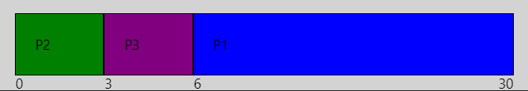

# Task Scheduling
## 1. Motivatie
- <b>Max CPU utilization:</b> Sa folosim la maxim CPU
- <b>Max throughput:</b> Sa complemtam cat mai multe task-uri intr-un interval de timp
- <b>Min turnaround time:</b> Sa minimizam timpul in care un task e dat jos de pe CPU
- <b>Min waiting time:</b> Sa minimizam timpul in care un task asteapta in ready queue
- <b>Min response time:</b> Sa minimizam timpul de cand a fost trimis un task pana cand a inceput sa ruleze pentru prima data

Le putem avea pe toate?

## 2. CPU/IO Bursts
- CPU Burst
    - Perioada in care un proces foloseste <b>activ</b> CPU pentru computatii.
    - Caracterizate de <b><i>durata</b></i> si <b><i>intensitate</b></i> (prin intensitate ne referim la cat de resource-demanding este, aceasta poate varia foarte mult in timpul unui proces)
- I/O Burst
    - Perioada in care un proces asteapta ca datele sa fie <b><i>citite</b></i> sau <b><i>scrise</b></i> din memorie, retea, etc.
    - Caracterizate de <b><i>waiting time</b></i> (cat dureaza sa fie executata operatia, depinde de viteza hardware-ului, mediul prin care trec datele, tipul operatiei) si <b><i>type</b></i>

> [~NOTE]
> I/O nu se refera neaparat la citit/scris de la tastatura, se refera de exemplu la citirea din memorie intr-un registru(fetch)
> [Fetch-Decode-Execute Cycle](https://www.geeksforgeeks.org/different-instruction-cycles/).

In cele mai multe cazuri burst-urile sunt <b>interconectate</b>. De exemplu o aplicatie web poate procesa request-uri (cpu burst) si citi/scrie date in memorie (i/o burst).  

## 3. CPU Scheduler
In principiu, alege un proces din <b><i>ready queue</b></i> si ii ofera locul pe CPU dupa o anumita <b>strategie</b>.

### 3.1 Non-preemptive
Deciziile Scheduler-ului pot aparea cand un proces isi schimba starea:
- running -> waiting
- running -> ready
- waiting -> ready
- devine terminated  

  

<b>Mai simplu</b>: Odata ajuns pe procesor, procesul nu va fi scos pana la o situatie de mai sus.

Cativa algoritmi:
- First Come, First Served (FCFS)
- Shortest Job First (SJF)
- Priority (non-preemptive version)

### 3.2 Preemptive
Procesele au un <b>timp limitat</b> pe care il pot petrece continuu pe CPU. Politica prin care alegem ce proces rulam depinde de algoritmul de Scheduling folosit.

<b>Concepte de considerat:</b>
- accesul la resurse comune
- procesele din kernel mode
- intreruperile din activitile cruciale ale OS-ului

Cativa algoritmi:
- Round Robin (RR)
- Shortest Remaining Time First (SRTF)
- Priority (preemptive version)

### 3.3 Tipuri de Scheduler
- Short-term 
    - Alege un proces din <b><i>ready queue</b></i>
- Medium-term 
    - Se ocupa de procesele ce necesita <b><i>I/O bursts</b></i>
- Long-term
    -  Decide <b>cate procese</b> pot ramane in ready queue
    -  Motivatia necesitatii este spatiul limitat din memoria principala, <b>programele</b> sunt initial tinute in <b><i>memoria secundata</b></i>, iar cand ajung in <b><i>memoria principala</b></i> ele devin <b>procese</b>
    - Practic, Long-term Scheduler-ul decide cat <b><i>multiprocessing</b></i> avem

## 4. Dispatcher
Treaba lui incepe dupa Scheduler. Dupa ce un task este ales, dispatcher-ul:
- muta procesul in <b>coada</b> corespunzatoare
- se ocupa de <b><i>context switch</b></i>
- schimba la <b><i>user mode</b></i>
- da <b><i>jump</b></i> la adresa de memorie corecta pentru a relua executia procesului 
- <b>trade off-ul</b> este ca si acesta necesita un <b>timp de executie</b>, chiar daca este destul de scurt si este dependent de <b><i>Scheduler</b></i>

## 5. Algoritmi Non-preemptive
> [!NOTE]  
> Diagramele pe care le vom folosi pentru a arata evolutia algorimilor se numesc <b><i>Grantt Chart</b></i>
### 5.1 First Come, First Served (FCFS)
Procele sunt puse pe CPU in ordinea in care au venit cand este liber

| Process      | Burst Time    | Arrival |
| ------------ | ------------- | ------- |
| $${\color{blue}P1}$$ | 24 | 0
| $${\color{green}P2}$$ | 3 | 1
| $${\color{purple}P3}$$ | 3 | 2

| Process      | Wainting Time |
| ------------ | ------------- |
| $${\color{blue}P1}$$ | 0 |
| $${\color{green}P2}$$ | Burst Time(P1) = 24 |
| $${\color{purple}P3}$$ | Burst Time(P1) + Burst Time(P2) = 24 + 3 = 27 |

Averate Waiting Time = avg(0 + 24 + 27) = 17

> [!CAUTION]
> Timpul mediu de asteptare este dependent de ordinea in care vin procesele
> Spre exemplu:  

| Process      | Burst Time    | Arrival |
| ------------ | ------------- | ------- |
| $${\color{blue}P1}$$ | 24 | 2
| $${\color{green}P2}$$ | 3 | 0
| $${\color{purple}P3}$$ | 3 | 1

| Process      | Wainting Time |
| ------------ | ------------- |
| $${\color{blue}P1}$$ | Burst Time(P2) + Burst Time(P3) = 3 + 3 = 6 |
| $${\color{green}P2}$$ | 0 |
| $${\color{purple}P3}$$ | Burst Time(P2) = 3 |

Averate Waiting Time = avg(0 + 3 + 6) = 3

> [!TIP]
> Putem folosi o tehnica <b><i>Greedy</b></i> pentru a ajunge la solutia optima.
> Sortam procesele dupa <b>Burst Time -> Shortest Job First</b>

### 5.2 Shortest Job First (SJF)
<b>Sortam crescator</b> task-urile dupa <b><i>burst time</b></i>

| Process      | Burst Time    |
| ------------ | ------------- |
| $${\color{blue}P1}$$ | 6 |
| $${\color{green}P2}$$ | 8 |
| $${\color{purple}P3}$$ | 7 |
| $${\color{red}P4}$$ | 3 |

$${Rezulta: \color{red}P4 \ \color{blue}P1 \ \color{purple}P3 \ \color{green}P2}$$

| Process      | Wainting Time |
| ------------ | ------------- |
| $${\color{blue}P1}$$ | Waiting Time(P4) + Burst Time(P4) = 0 + 3 = 3  |
| $${\color{green}P2}$$ | Waiting Time(P3) + Burst Time(P3) = 9 + 7 = 16|
| $${\color{purple}P3}$$ | Waiting Time(P1) + Burst Time(P1) = 3 + 6 = 9 |
| $${\color{red}P4}$$ | 0 |

Averate Waiting Time = avg(3 + 16 + 9 + 0) = 28 / 4 = 7

> [!IMPORTANT] 
> Q: Ok dar cum stim cat va dura un proces?  
> A: Putem doar estima, nu putem vedea in viitor

## 6. Algoritmi Preemptive
### 6.1 Shortest Remaining Time First (SRTF)
Punem pe CPU procesul care e cel mai aproape de a se termina, foarte important este timpul la care ajunge un nou proces

| Process      | Burst Time    | Arrival |
| ------------ | ------------- | ------- |
| $${\color{blue}P1}$$ | 8 | 0
| $${\color{green}P2}$$ | 4 | 1
| $${\color{purple}P3}$$ | 9 | 2
| $${\color{red}P4}$$ | 5 | 3

## Pas cu pas
### Timp 0: Apare P1
| Active Process | Burst Time Left | Arrival |
| -------------- | --------------- | ------- |
| $${\color{blue}P1}$$ | 8 | 0

### Timp 1: Apare P2 si il scoate pe P1

| Active Process | Burst Time Left | Arrival |
| -------------- | --------------- | ------- |
| $${\color{blue}P1}$$ | 7 | 0
| $${\color{green}P2}$$ | 4 | 1

### Timp 5: Se termina P2, au aparut celelate procese dar niciunul nu a avut Burst-ul suficient de mic incat sa intre peste P2, cel mai mic timp il are P4 si intra

| Active Process | Burst Time Left | Arrival |
| -------------- | --------------- | ------- |
| $${\color{blue}P1}$$ | 7 | 0
| $${\color{purple}P3}$$ | 9 | 2
| $${\color{red}P4}$$ | 5 | 3

### Timp 10: Se termina P4, intra P1

| Active Process | Burst Time Left | Arrival |
| -------------- | --------------- | ------- |
| $${\color{blue}P1}$$ | 7 | 0
| $${\color{purple}P3}$$ | 9 | 2

### Timp 17: Se termina P1, intra P3

| Active Process | Burst Time Left | Arrival |
| -------------- | --------------- | ------- |
| $${\color{purple}P3}$$ | 9 | 2

### Timp 26: Se termina P3

### 6.2 Priority Scheduling
- Atribuim si un numar care reprezinta importanta task-ului.  
- Conceptul functioneaza si in cazul non-preemptive
- De ce ar am avea nevoie de asta?  
Daca facem accident cu masina preferam sa intre sistemul ABS, nu sa cante radio-ul.
- In exemplul asta presupunem numerele mai mici ca fiind prioritati mai mari

| Process      | Burst Time    | Priority |
| ------------ | ------------- | ------- |
| $${\color{blue}P1}$$ | 10 | 3
| $${\color{green}P2}$$ | 1 | 1
| $${\color{purple}P3}$$ | 2 | 4
| $${\color{red}P4}$$ | 1 | 5
| $${\color{yellow}P5}$$ | 5 | 2

> [!WARNING]  
> Situatie: Daca avem un proces P cu o prioritate 5 care isi aseapta locul pe CPU si inaintea lui in fiecare secunda apar alte procese cu o prioritate 2?  
> Problema: Se poate ca P sa nu ruleze niciodata <b><i>(Starvasion)</b></i>  
> Solutie: Putem creste prioriatea proceselor care stau prea mult in asteptare <b><i>(Aging)</b></i>

### 6.3 Round Robin (RR)
- Fiecare proces primeste o unitate de timp pe care o poate petrece pe CPU <b><i>(quanta)</b></i> dupa care e trimis la capatul cozii
- Daca avem <b><i>n</b></i> procese si <b><i>q</b></i> quanta
    - terminam in <b><i>n * q</b></i> unitati de timp
    - niciun proces nu poate astepta mai mult de <b><i>(n-1)q</b></i>
    - fiecare proces primeste <b><i>1/n</b></i> din timp-ul CPU-ului in chunk-uri de maxim <b><i>q</b></i> unitati de timp

> [!NOTE]  
> <b><i>q</b></i> prea mare -> doar <b><i>FIFO</b></i>  
> <b><i>q</b></i> prea mic -> multe <b><i>context switch-uri</b></i>  

| Active Process | Burst Time Left |
| -------------- | --------------- |
| $${\color{blue}P1}$$ | 20
| $${\color{green}P2}$$ | 3
| $${\color{purple}P3}$$ | 5
q = 4

> [!CAUTION]  
> Chiar daca la rand este acelasi proces (ex: timpii 16-28)
> Tot va avea loc un <b><i>context switch</b></i>

## 7. Cum determinam lungimea urmatorului Burst?
- Folosind <b><i>Exponential averaging/smoothing</b></i>, e o metoda de aproximare a seriilor de timp
- Vom incepe de estimarea de la ultimul burst cunoscut
- Notatii:
$$
    t_n = lungimea \ \textbf{reala} \ a \ burstului \ n \\
    \tau _{n+1} = predictia \ urmatorului \ burst \\
    \alpha, 0 \leq \alpha \leq 1
$$
- Definim:
$$
    \tau_{n+1} = \alpha t_n + (1-\alpha)\tau_n
$$
> [!NOTE]  
> Formula estimeaza burst-ul viitor bazat pe burst-urile anterioare.  
> <b>Constanta</b> alpha decide "cat conteaza experienta trecuta"  

- Obersatii:
$$
\begin{array}{rl}
    & \alpha = 0.6 \rightarrow \text{evenimentul curent conteaza in proportie de 60\%} \\
    & \rightarrow \text{evenimentele trecute conteaza\ (1 - 60)\%} \\

    & \alpha = 0 \rightarrow \text{tecutul nu conteaza}\\

    & \alpha = 1 \rightarrow \text{predictia se bazeaza doar pe evenimente trecute} \\

    & \alpha = 1/2 \text{ e o valoare comun aleasa} \\ 
\end{array}
$$

- Exemplu:  

- Interpretare:
$$
\begin{array}{rl}
    0. & \tau_1 = 10, \text{ presupunem ca incepem cu un burst de } 10 \\
       & \alpha = 1/2 \text{, alegem coeficientul} \\
    & \\
    1. & t_1 = 6, \text{ primim burst de } 6 \\
       & \tau_2 =  \alpha t_1 + (1-\alpha)\tau_1 \text{, inlocuim cunoscutele}\\
       & \tau_2 = \frac{1}{2} * 6 + (1-\frac{1}{2})*10 \\
       & \tau_2 = 8 \text{, avem urmatoarea predictie}\\
       & \\
    2. & t_2 = 4 \text{, primim burst 4} \\
       & \tau_3 = \alpha t_1 + (1-\alpha)\tau_1 \text{, inlocuim cunoscutele}\\
       & \tau_3 = \frac{1}{2} * 4 + (1-\frac{1}{2})*8 \\
       & \tau_3 = 6 \text{, avem urmatoarea predictie}\\
    ...
\end{array}
$$

- Termen general:
$$
\tau_{n+1} = \alpha t_n + (1 - \alpha) \tau_{n-1} + \ldots + (1 - \alpha)^j \tau_{n-j} + \ldots + (1 - \alpha)^{n+1} \tau_0 \\

\equiv \tau_{n+1} = \alpha t_n + \sum_{j=0}^{n} (1 - \alpha)^j \tau_{n-j}
$$
Observam ca (1-alpha) ste subunitar, iar la fiecare pas e ridicat la un exponent mai mare, scazand impactul predictiilor trecute pentru suma.

## Referinte
- https://www.os-book.com/OS9/slide-dir/index.html
- https://www.baeldung.com/cs/cpu-io-burst-cycles
- https://www.geeksforgeeks.org/preemptive-and-non-preemptive-scheduling/
- https://www.geeksforgeeks.org/difference-between-dispatcher-and-scheduler/
- https://en.wikipedia.org/wiki/Exponential_smoothing
