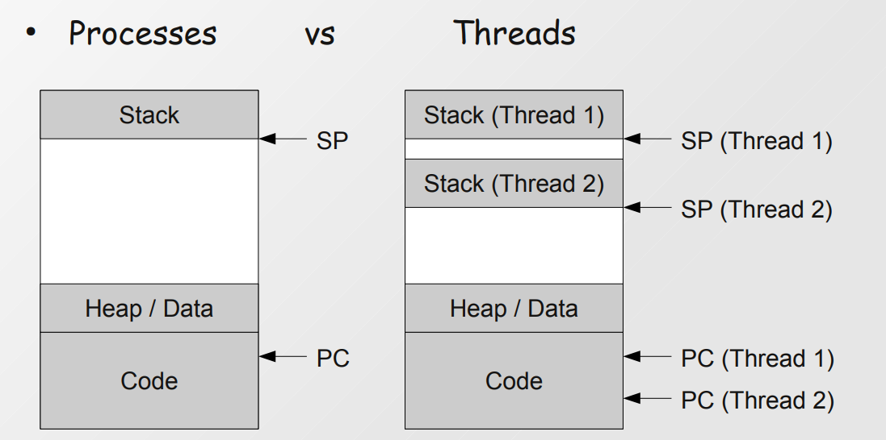
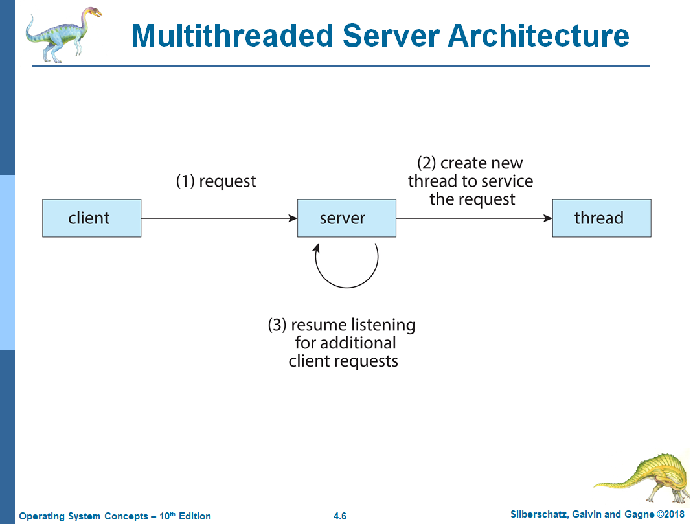
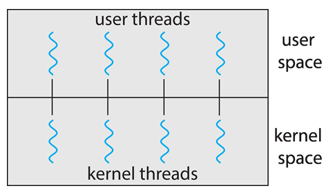
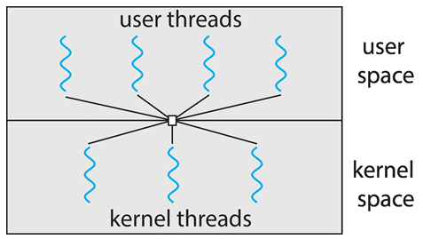
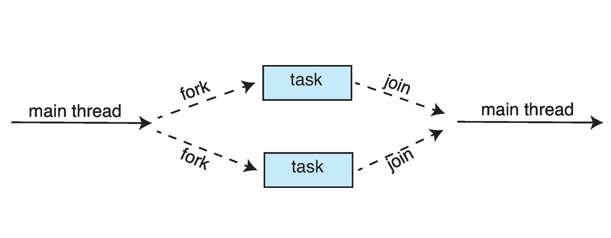
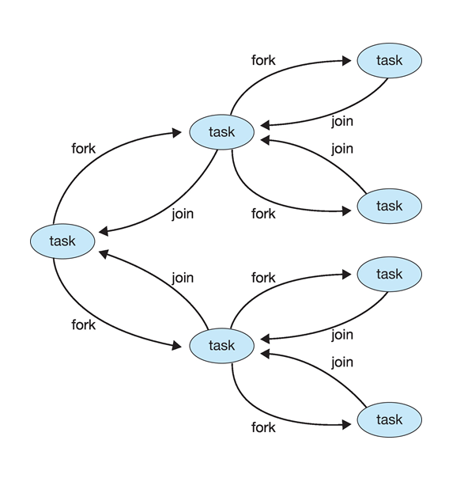

# Thread-uri
## 1.Definitie
Cea mai mica secventa de instructiuni dintr-un proces, care poate fi considerata de scheduler.

## 2.Motivatie
### Scurt motiv istoriv
- Prin 70'- 90' hardware-ul a devenit mai performant si s-a ajuns ca procesorul sa nu fie utilizat la capacitate maxima.<br>
<b>Solutia:</b> Multiprocessing/Multithreading
 
### Comparativ cu multiprocessing
- Crearea unui <b>process</b> nou necesita mult mai multe resurse

- In cazul multithreading <b>resursele sunt impartite</b> facilitand comunicarea intre thread-uri

- Pentru fiecare thread vom avea un <b><i>instruction pointer</i></b> peste acelasi cod, procesele au un singur instruction pointer si copiaza zona de cod 


## 3.Down Sides
- Sintaxa e mai greoaie

- Daca un thread produce o eroare, tot procesul moare

- Thread-urile se pot afla in momente diferite ale executiei, iar <b>sincronizarea</b> lor devine mult mai dificila. Si faptul ca impart resurse devine o problema de sincronizare :)

- Nu exista o limita de cate thread-uri poti crea, insa daca depasesti cu mult numarur de <b>core-uri din CPU</b> nu vei mai aduce nicio performanta suplimentara.<br>
Exemplu: Ai 4core-uri -> cam 8 thread-uri e inca ok.

- Thread-urile sunt duplicate de fork() ? Dar exec() ?

## 4.Sintaxa Unix
Sintaxa de thread-uri difera in functie de tipul OS-usului. Pentru sistemele Unix folosim libraria Thread-uri POSIX din libraria <b><i>pthread</i></b>

### Antetele
```c

int pthread_create(pthread_t *restrict thread,
                    const pthread_attr_t *restrict attr,
                    void *(*start_routine)(void *),
                    void *restrict arg);
                    
int pthread_join(pthread_t thread, void **retval);
```

### Exemplu
```c
#include <pthread.h>
#include <stdio.h>
#include <stdlib.h>

// Functie void* care primeste parametru void*
void *threadFunction(void *arg) {
    printf("Hello from the thread! Argument passed: %d\n", *(int *)arg);
    return NULL;
}

int main() {
    pthread_t thread; // Identificatorul thread-ului
    int arg = 42;     // Argument de pasat thread-ului
    
    // Creare thread
    int result = pthread_create(&thread, NULL, threadFunction, &arg);

    // Returneaza 0 daca e ok
    // Genul asta de scriere se mai numeste si 'garda'
    // De ce dam return 0 la final de prgoram?
    if (result != 0) {
        fprintf(stderr, "Error creating thread\n");
        // Terminam programul cu codul de eroare 1
        exit(1);
    }

    // Asteapta ca thread-ul sa se termine, nu se va trece peste linia asta
    // pana cand thread-ul nu termina executia
    pthread_join(thread, NULL);

    printf("Thread has finished executing.\n");
    return 0;
}
```
## Pe bucati :)
<b>Sfat:</b> CITITI DIN MANUAL. <br>
Doar deschizi un terminal si dai 

```
man exit
man pthread_join
man pthred_create
...
```

Functiile astea au fost folosite in implementarea OS-ului si sunt documentate foarte clar.

Inapoi la explicatii :)

```c
pthread_t // Tipul de date pentru thread-uri, _t vine de la 'type', e o
          // conventie comuna
```

```c
int arg // Argumentele pe care le vom pasa functiei thread-ului
        // Asta e cazul simplu in care functia noastra ia un singur argument

        // 'arg' e o numire conventionala de la 'argument(s)'
        // 'argc'-> arguments count
        // 'argv'-> argument vector

        // Cum am putea trimite mai multe date simultan printr-o singura
        // variabila (pe care o vom numi 'args') ?
```

```c
pthread_create(&thread, NULL, threadFunction, &arg);
    // parametru 1: variabila 'pthread_t' pe care sa fie pornit
    // parametru 2: diverse configurari
    //              ex: stack_size, scheduling_policy, cancelability, etc
    // parametru 3: functia pe care va fi pornit thread-ul
    // parametru 4: argumentele functiei

    // Return: 0 la succes
    //         altceva la eroare
```

```c
// Obligatoriu void* -uri !
// Ce se intampla cu return-ul? Il putem lua din pthread_join
// De ce void* arg? Sa fie generic, putem pasa orice tip de adrese la void*, int&, char&, un struct&, orice.  
void *threadFunction(void *arg) {
    printf("Hello from the thread! Argument passed: %d\n", *(int *)arg);
    // De ce facem smecheria asta cu *(int *) arg?
    // Cum altfel putem lua ceva valoare returnata fara sa dam return?
    return NULL;
}
```

```c
// Impiedica codul sa avanseze pana cand thread-ul isi termina executia
pthread_join(thread, NULL);
// parametru 1: thread-ul asteptat
// parametru 2: valoarea returnata de thread
```

## 5. Anularea unui Thread
- Putem opri un thread inainte sa-si termine executia folosind <b><i>pthread_cancel()</b></i>  
- Va returna 0 daca s-a realizat cu succes

Antet
```c
int pthread_cancel(pthread_t thread);
```
- Daca un thread are atributul de cancel dezactivat si trimitem un request de cancel, acesta va ramane <b><i>pending</b></i> pana statusul thread-ului va fi schimbat si se va putea executa cancel-ul.

## 6. Thread Local Storage
- Este o constructie foarte asemanatoare datelor locale ale unor metode, dar nu despre ele este vorba
- Fiecare thread va avea instanta lui asupra variabilei respective, dar trebuie definite explicit

Exemplu cpp:
```Cpp
#include <iostream>
#include <thread>

thread_local int threadSpecificValue = 0;

void incrementValue() {
    ++threadSpecificValue;
    std::cout << "Thread ID: " << std::this_thread::get_id() << ", Value: " << threadSpecificValue << std::endl;
}

int main() {
    std::thread t1(incrementValue);
    std::thread t2(incrementValue);

    t1.join();
    t2.join();

    return 0;
}

```

## 6. Multithreaded Server Architecture
Ok, scenariu:<br>
Esti Amazon. Iti vine un client cu o comanda. Ce faci, astepti sa termini cu comanda lui sau ii dai altcuiva sa se ocupe cat tu astepti alt client?<<br>
Daca ai procesa toate request-urile liniar toate request-urile noi vor astepta dupa procesarea celor vechi, asa ca pentru fiecare request poti porni un thread nou cat tu astepti sa primesti cat mai multe request-uri, iar clientul nu trebuie sa astepte, iar in simultan se pot proesa mai multe request-uri



## 7. User Threads vs Kernel Threads
- User Threads   
    -> thread-urile create de user  
    -> in <i><b>user space</b></i>  
    -> trebuie manage-uite de user(create, join, sincronizarem, resurse,etc)

- Kernel Threads  
    -> in <i><b>kernel space</b></i>  
    -> manage-uite de kernel


## 8. Multithreading Models
1. Many-to-One
    - Ai mai multe user thread-uri concurente mapate pe un singur kernel thread
    - Nu pot rula mai multe user threads simultan pentru ca momentan poate exista un singur kernel thread
    - Mai putin comun
    - Exemple: Solaris Green Threads, GNU Portable Trheads

    

2. One-to-One
    - Pentru fiecare user thread ai un kenrel thread
    - Poate exista o limita la cate thread-uri se pot mapa totusi
    - Ai o concurenta mult mai buna decat modelul precedent
    - Exemple: Windows, Linux

    

3. Many-to-Many
    - Mai multe user thread-uri mapate la mai multe kernel thread-uri
    
    

## 9. Metode de Threading Implicit
### Threading-ul <i>implicit</i> este realizat in spate in compilatoare si alte librarii la run-time pentru eficientizare. (Cel <i>explicit</i> de catre programator in cadrul unui program)

1. Thread Pool
    - Un video foarte dragut cu o implementare gasiti [aici](https://www.youtube.com/watch?v=_n2hE2gyPxU&ab_channel=CodeVault).
    - <b>Ideea</b>: Ai un numar stabilit de thread-uri care asteapta task-uri noi si nu mor niciodata
    - Cream initial un numar mic de thread-uri
    - Cand apare un task nou, cautam un thread liber
    - Daca toate thread-urile sunt ocupate, se va astepta eliberarea unuia

    - La compilare sau run-time ?

> [!TIP]
> Implemtenetarea contine multe concepte de sincronizare, putem detalia in viitor

2. Paralelism Fork-Join
    - Task-ul principal este spart in altele mai mici si pot fi executate concurent
    - Stilul <b>divide et impera</b>
    - La run-time sau compilare?






3. OpenMP
    - Un API multi-platform (C/C++ si Fortran) pentru calculul in paralel
    - Identifica sectiuni de cod ce pot fi paralelizate
    - Ofera suport pentru mediile shared-memory
    - Creaza un numar de thread-uri egaul cu numarul de core-uri

Exemplu:

```C
#include <stdio.h>
#include <omp.h>

int main() {
    int i;
    int array[10];

    // For paralelizat
    #pragma omp parallel for
    for (i = 0; i < 10; i++) {
        array[i] = i * i;
        printf("Thread %d calculated array[%d] = %d\n", omp_get_thread_num(), i, array[i]);
    }

    return 0;
}
```

4. Grand Central Dispatch
    - Un API de la Apple asemanator cu OpenMP
    - Task-urile se afla intr-un <b><i>queue</b></i> de <b>dispatch</b> si este de 2 feluri:
        - Serial: 
            - initial un singur queue per proces dar pot fi create mai multe
            - task-urile sunt executate unul cate unul
        - Concurent:
            - task-urile sunt scoate tot FIFO, dar pot fi scoase mai multe simultan
    - Block-urile de cod paralelizate sunt marcate cu <b>^{}</b>
```C
    ^{ prinf("I am a block");}  
```


5. Intel Threading Building Blocks (TBB)
    - Este asemanator cu OpenMP insa aduce o solutie high-level

## Referinte
- https://codex.cs.yale.edu/avi/os-book/OS10/slide-dir/index.html

- https://courses.cs.washington.edu/courses/csep548/06au/lectures/mtStudent.pdf

- https://www.cs.auckland.ac.nz/courses/compsci230s1c/lectures/nasser/21_Multi-threading.pdf

- https://www.youtube.com/@CodeVault